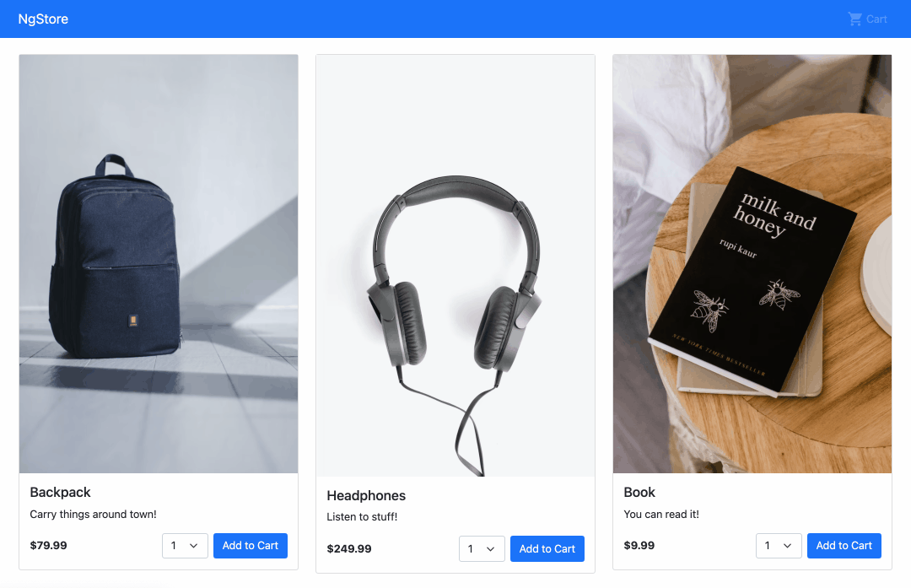

# NgStore

## About The Project

NgStore is ecommerce Angular application that allows users to view a list of available products to purchase, add them to a shopping cart, and ultimately complete the checkout process.

## Project features

This application reflects the same user experience as that of a real-world e-commerce website, including a(n):

* **Product list** page, which displays the available products for the user to choose and add to their cart (in various quantities)
* **Product details** page, which displays more information about any particular product
* **Shopping cart**, which includes the products that the user has added to their cart
* **Checkout form**, which collects information about the user (e.g., name, address, payment details, etc.)
* **Order confirmation page**, which shows the outcome after the user completes the checkout process (i.e., submits the checkout form)

## Getting Started

Run `yarn install` or `npm install`.

## Development server

Run `ng serve` for a dev server. Navigate to `http://localhost:4200/`. The app will automatically reload if you change any of the source files.

## Code scaffolding

Run `ng generate component component-name` to generate a new component. You can also use `ng generate directive|pipe|service|class|guard|interface|enum|module`.

## Build

Run `ng build` to build the project. The build artifacts will be stored in the `dist/` directory.

## Running unit tests

Run `ng test` to execute the unit tests via [Karma](https://karma-runner.github.io).

## Running end-to-end tests

Run `ng e2e` to execute the end-to-end tests via a platform of your choice. To use this command, you need to first add a package that implements end-to-end testing capabilities.

## Further help

To get more help on the Angular CLI use `ng help` or go check out the [Angular CLI Overview and Command Reference](https://angular.io/cli) page.
